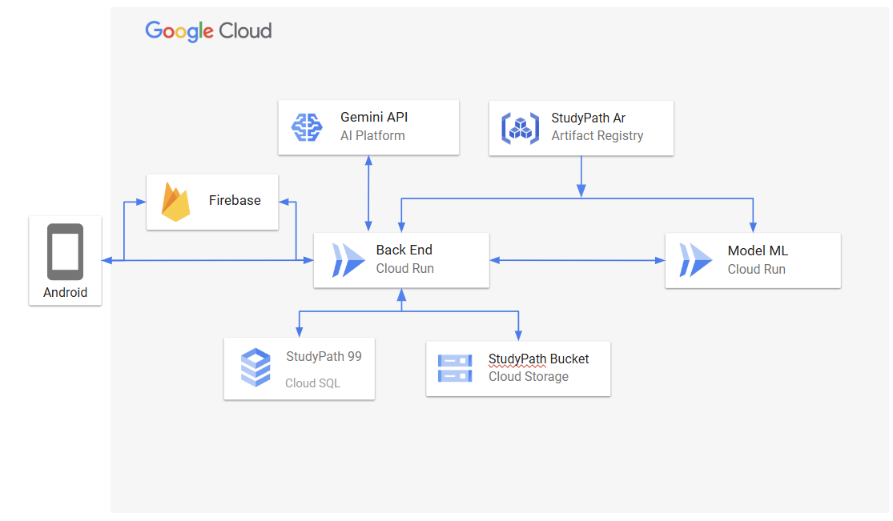

# Bangkit 2024 Batch 2 Capstone Team - Product Track
## C242-PS142 - StudyPath


## Team Member
| 🎓 **Name** | 🏫 **University** | 📂 **Learning Path** | 🌐 **GitHub Profile** | 🔗 **LinkedIn Profile** |
|:-|:-|:-|:-|:-|
| **Abimanyu Tri Wicaksono** | Universitas Amikom Yogyakarta | Machine Learning | [](https://github.com/mozaa86) | [](https://www.linkedin.com/in/abimanyu-tri-wicaksono-24814b305) |
| **Ferdinanta Ginting** | Universitas Mikroskil | Machine Learning | [](https://github.com/ferdinann) | [](https://www.linkedin.com/in/ferdinanta) |
| **Siti Yuniasih** | Universitas Terbuka | Machine Learning | [](https://github.com/junefile) | [](https://www.linkedin.com/in/siti-yuniasih-ba7266252) |
| **Johanes Nicky Cocasi Silaban** | Universitas Mikroskil | Cloud Computing | [](https://github.com/apanyaclay) | [](https://www.linkedin.com/in/johanes-nicky-cocasi-silaban) |
| **Rio Aditya** | Institut Teknologi Sumatera | Cloud Computing | [](https://github.com/RioAditya1605) | [](https://www.linkedin.com/in/rio-aditya-a621612a6) |
| **Ripat Al Safar** | Universitas Mikroskil | Mobile Development | [](https://github.com/Ripat-2345) | [](https://www.linkedin.com/in/ripat-al-safar) |
| **Sayid Achmad Maulana** | Universitas Dinamika Bangsa | Mobile Development | [](https://github.com/SoloKode) | [](https://www.linkedin.com/in/sayid-achmad) |


<h2 align="center">⚙️ Tech Stack ⚙️</h2>

<h3 align="center">Machine Learning</h3>

<div align="center">
  <a href="https://www.tensorflow.org/" target="_blank">
    
  </a>
  
  <a href="https://www.jupyter.org/" target="_blank">
    
  </a>
  
  <a href="https://www.python.org/" target="_blank">
    
  </a>
</div>

###

<h3 align="center">Cloud Computing</h3>

<div align="center">
  <a href="https://cloud.google.com/" target="_blank">
    
  </a>
  
  <a href="https://www.javascript.com/" target="_blank">
    
  </a>
  
  <a href="https://www.python.org/" target="_blank">
    
  </a>
</div>

###

<h3 align="center">Mobile Development</h3>

<div align="center">
  <a href="https://www.figma.com/" target="_blank">
    
  </a>
  
  <a href="https://developer.android.com/studio" target="_blank">
    
  </a>
  
  <a href="https://kotlinlang.org/" target="_blank" width="10">
    
  </a>
</div>

## Concept Overview

**Cloud Architecture:**



**Google Cloud's pricing calculator:**

[Cost Estimate Summary](https://cloud.google.com/products/calculator/?hl=id&dl=CjhDaVJsTlRSbFpqUXdNUzB4TlRNMExUUTBPV1V0T0dSbE55MHhNR013TTJSa04yRTNaVGNRQVE9PRAJGiQxNjY0MjNGQS1CQ0Q0LTQyREUtOUE1Ni0wRDRGMEYxNTRGNjA)

---

**API Documentation:**
```
https://study-path-app-402921283643.asia-southeast2.run.app/api-docs
```


